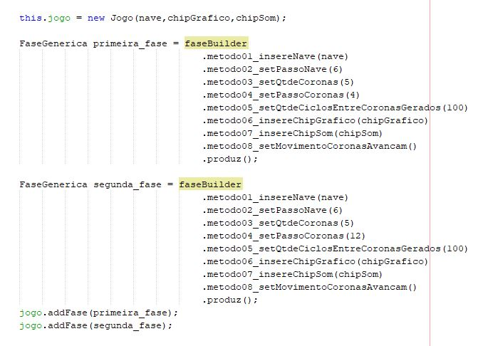

<!-- PROJECT LOGO -->
 

  <h3 align="center">Café Teórico TV - SpaceShip</h3>

  

    :brazil: Código para aprendizado de Orientação a Objetos!  
    :uk: Game coding for OOP learning.
     
     
  

<!-- ABOUT THE PROJECT -->
## About The Project

:brazil: 
Este é um projeto que comecei porque eu estava querendo praticar um pouco do Orientação a Objetos. Tentei implementar alguns testes automatizados mas ainda não domino bem a prática de usar Mocks. 
:uk: 
This is an attemptive to turn the OOP learning a bit more interesting. I tried to code in the simplest way I could, but I hope you can notice the OOP techniques. 

### Built With

:brazil: 
O código está em java e utilizei o NetBeans como IDE. Não há nada mais de extraordinário do que isso. 
:uk: 
The language is Java. There is no extraordinary tools but the Java coding. You shouldn't have great expectations about the game. It's just coding. :-P  
* [Java](https://getbootstrap.com)
* [NetBeans](https://https://netbeans.org/)

<!-- GETTING STARTED -->
## Getting Started

### Prerequisites
:brazil: 
É necessário entender como é o ESQUELETO deste projeto. As classes possuem 03 métodos principais que são disparados na respectiva ordem: 
<ol>
    <li>
      recebeComando() 

    
 
 
     </li> 
  <li>
 executaCiclo() 

    
   
  
  </li> 
    <li>
desenha()    

    
   
 
        </li> 
      <li>
tocaAudio()    

    
 
 
        </li>   

Também foi utilizado o padrão de projeto State para implementar a classe Jogo. Para a passagem de estados eu utilizei PERGUNTAS (métodos que retornam um valor boolean).  
    
  
 
Por fim achei interessante utilizar um Builder para construir as fases, pois ficamos livres para aumentar a dificuldade e outras coisinhas também. Cada fase é inserida no jogo atravês do método jogo.addFase(FaseGenerica fase) e são percorridas na ordem que são inseridas.  
    
  
 
   
:uk: 
I'll write here the books from where I learned the coding techniques I applied in this project.  

### Installation

:brazil: 
Faça o download do NetBeans e o instale. [https://netbeans.org](https://netbeans.org) 
:uk: 
Download and install NetBeans IDE. [https://netbeans.org](https://netbeans.org) 

<!-- CONTRIBUTING -->
## Contributing

:brazil: 
Vocês podem copiar o código à vontade. Aceito críticas e sugestões de melhorias.  
Tem umas partes do código que podem ser melhoradas (refatoradas), por exemplo a interface MovimentoGenerico, acredito que uma classe abstrata com os métodos principais já implementados e apenas alguns métodos abstratos sejam a melhor escolha. Mas no momento vou deixar como está e vou começar outro projeto. Deixo esse homework para quem quiser praticar um pouco de OOP. :-P  
:uk: 
You can download the code at will. Feel free to make suggestions about the techniques.  

<!-- LICENSE -->
## License

Distributed under the MIT License. See `LICENSE` for more information.

<!-- CONTACT -->
## Contact

Heribeto Pedroso - [linkedin](https://linkedin.com/in/heripedroso) - heri.pedroso@gmail.com  
Café Teórico TV - [@cafeteorico.tv](https://instagram.com/cafeteorico.tv) - cafeteorico.tv@gmail.com  
Project Link: [https://github.com/heripedroso/CafeTeoricoTV_SpaceShip](https://github.com/heripedroso/CafeTeoricoTV_SpaceShip)  

<!-- MARKDOWN LINKS & IMAGES -->
<!-- https://www.markdownguide.org/basic-syntax/#reference-style-links -->
[contributors-shield]: https://img.shields.io/github/contributors/othneildrew/Best-README-Template.svg?style=for-the-badge
[contributors-url]: https://github.com/heripedroso/CafeTeoricoTV_SpaceShip/graphs/contributors
[forks-shield]: https://img.shields.io/github/forks/othneildrew/Best-README-Template.svg?style=for-the-badge
[forks-url]: https://github.com/heripedroso/CafeTeoricoTV_SpaceShip/network/members
[stars-shield]: https://img.shields.io/github/stars/othneildrew/Best-README-Template.svg?style=for-the-badge
[stars-url]: https://github.com/heripedroso/CafeTeoricoTV_SpaceShip/stargazers
[license-shield]: https://img.shields.io/github/license/othneildrew/Best-README-Template.svg?style=for-the-badge
[license-url]: https://github.com/heripedroso/CafeTeoricoTV_SpaceShip/blob/master/LICENSE.txt
[linkedin-shield]: https://img.shields.io/badge/-LinkedIn-black.svg?style=for-the-badge&logo=linkedin&colorB=555
[linkedin-url]: https://linkedin.com/in/heripedroso
[product-screenshot]: images/screenshot.png
